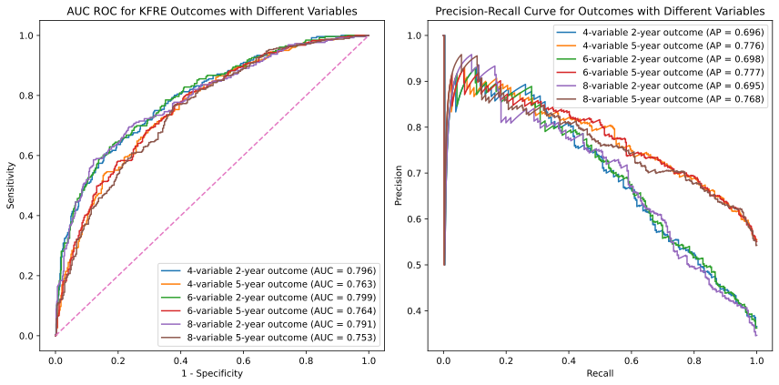

.. _usage_guide:   

.. _target-link:

.. raw:: html

   

.. raw:: html

   

.. raw:: html
   
   

\

Description
===========

This section provides guidance on using the KFRE library.

The ``kfre`` library offers a flexible and user-friendly interface to estimate the 
risk of kidney failure for individual patients using the KFRE model developed by Tangri et al. With 
``kfre``, you can calculate the risk using the classic 4-variable model, the 
detailed 8-variable model, and, uniquely, a 6-variable model that is not commonly 
found in online calculators.

Single Patient Risk Calculation
===============================

The ``kfre_person`` function allows for detailed, personalized risk assessments 
based on a range of clinical parameters. Depending on the completeness of the 
data provided, the function can apply a basic 4-variable model or more 
comprehensive models incorporating additional risk factors like diabetes, 
hypertension, and various biochemical markers.

The function is designed for ease of use in clinical settings or research, 
providing immediate risk estimations that are crucial for patient management or 
further analysis.

.. function:: kfre_person(age, is_male, eGFR, uACR, is_north_american, years, dm, htn, albumin, phosphorous, bicarbonate, calcium)

    :param age: Age of the patient.
    :param bool is_male: ``True`` if the patient is male, ``False`` if female.
    :param float eGFR: Estimated Glomerular Filtration Rate.
    :param float uACR: Urinary Albumin to Creatinine Ratio.
    :param bool is_north_american: ``True`` if the patient is from North America, ``False`` otherwise.
    :param int years: Time horizon for the risk prediction (default is 2 years). 
    :param float dm: (`optional`) Diabetes mellitus indicator. ``(1=yes; 0=no).``
    :param float htn: (`optional`) Hypertension indicator. ``(1=yes; 0=no).``
    :param float albumin: (`optional`) Serum albumin level.
    :param float phosphorous: (`optional`) Serum phosphorous level.
    :param float bicarbonate: (`optional`) Serum bicarbonate level.
    :param float calcium: (`optional`) Serum calcium level.

    :returns:  ``float``: The risk of developing CKD within the specified timeframe, as a decimal. Multiply by 100 to convert to a percentage.

  
**Example Usage** 

.. code-block:: python

    from kfre import kfre_person

.. code-block:: python

    risk_percentage = kfre_person(
        age=57.28,
        is_male=False,
        eGFR=15.0,
        uACR=1762.001840,
        is_north_american=False,
        years=2,
        dm=None,
        htn=None,
        albumin=None,
        phosphorous=None,
        bicarbonate=None,
        calcium=None
    ) * 100  # Convert to percentage

    message = f"The 2-year risk of kidney failure for this patient is"
    print(f"{message} {risk_percentage:.2f}%.")    

.. code-block:: bash

    The 2-year risk of kidney failure for this patient is 44.66%.

**Example Calculation for 2-year and 5-year Risk**

Here's how to estimate the 2-year and 5-year kidney failure risk for a 
hypothetical 57.28-year-old female who is not from North America and has 
specific clinical characteristics.

Ensure to:  

- Uncomment ``dm`` and ``htn`` if you are using the 6-variable KFRE model.  

- For the 8-variable KFRE, keep ``dm`` and ``htn`` commented out and instead, uncomment the ``albumin``, ``phosphorous``, ``bicarbonate``, and ``calcium`` variables.

.. code-block:: python

    for years in [2, 5]:
        risk_percentage = (
            kfre_person(
                age=57.28,
                is_male=False,  # is the patient male?
                eGFR=15.0,  # ml/min/1.73 m^2
                uACR=1762.001840,  # mg/g
                is_north_american=False,  # is the patient from North America?
                years=years,
                ################################################################
                # Uncomment "dm" and "htn" for the 6-variable model:
                ################################################################
                # dm=0,
                # htn=1,
                ################################################################
                # Comment out "dm" and "htn"; uncomment the following lines for
                # the 8-variable model:
                ################################################################
                # albumin=3.0, # g/dL
                # phosphorous=3.162, # mg/dL
                # bicarbonate=21.3, # mEq/L
                # calcium=9.72, # mg/dL
            )
            * 100  # multiply by 100 to convert to percentage
        )

        message = f"The {years}-year risk of kidney failure for this patient is"
        print(f"{message} {risk_percentage:.2f}%.")    

.. code-block:: bash

    The 2-year risk of kidney failure for this patient is 44.66%.
    The 5-year risk of kidney failure for this patient is 89.89%.    

Conversion of Clinical Parameters
=================================

The ``kfre`` library includes a utility function ``perform_conversions`` 
designed to convert clinical measurement units. This function is especially 
useful when preparing data for analyses that require specific units. It can 
handle conversions for multiple parameters, such as urinary protein-creatinine 
ratio (uPCR), calcium, phosphate, and albumin levels.

**Key Features**

- **Flexible Conversion:** The function supports both standard and reverse conversions, allowing users to switch between units as needed.
- **Batch Processing:** It can process entire columns of data, making it suitable for datasets with multiple patients.
- **Custom Column Names:** Users can specify which columns to convert, providing flexibility in handling datasets with varied naming conventions.

uPCR to uACR
-------------

The conversion of uPCR from mg/mmol to mg/g involves understanding that both 
mg/mmol and mg/g are ratios that can be related through their units.

- mg/mmol is a ratio of mass (in milligrams) to molar concentration (in millimoles), while
- mg/g is a ratio of mass (in milligrams) to mass (in grams).

To convert mg/mmol to mg/g, we need to know the molar mass of creatinine, 
because uPCR is the ratio of the mass of protein to the mass of creatinine. 
The molar mass of creatinine is approximately 113.12 g/mol. Therefore, 1 mmol of 
creatinine is 113.12 mg.

Here's the conversion:

1 mg/mmol means that you have 1 mg of protein for every 1 mmol of creatinine.
Since 1 mmol of creatinine is 113.12 mg:

.. math::

    \frac{\text{1 mg protein}}{\text{0.11312 g creatinine}} \approx 8.84  {\text{ mg/g}}

Calcium
-------

Calcium is often measured in millimoles per liter (mmol/L) and needs to be 
converted to milligrams per deciliter (mg/dL) for certain clinical applications 
or study comparisons.
- Molecular weight of Calcium (Ca): Calcium's atomic weight is approximately 40.08 g/mol.
- Conversion factor: To convert mmol/L to mg/dL for calcium, you multiply by 4. 
This is derived as follows:

.. math::

    \text{1 mmol/L} \times  \frac{\text{40.08 mg}}{{\text{1 mmol}}} \times \frac{\text {1L} } {\text{10 dL}} = 4.008 \text{ mg/dL}

Phosphate
---------

Phosphate concentrations are similarly reported in mmol/L but often need to be expressed in mg/dL.

- Molecular weight of Phosphate (PO₄³⁻): The molar mass of phosphate as an ion (considering phosphorus and oxygen) is approximately 94.97 g/mol.
- Conversion factor: To convert mmol/L to mg/dL for phosphate:

.. math::

    \text{1 mmol/L} \times  \frac{\text{94.97 mg}}{{\text{1 mmol}}} \times \frac{\text {1L} } {\text{10 dL}} \approx 9.497 \text{ mg/dL}

Albumin
-------

Albumin measurements are often made in grams per liter (g/L) and converted to 
grams per deciliter (g/dL) for standard reporting in many clinical contexts.

Conversion factor: Converting g/L to g/dL is straightforward as it involves 
shifting the decimal point:

.. math::

    1\text{ g/L} \div 10 = 0.1 \text { g/dL}

These conversions help ensure consistency in reporting and interpreting lab 
values across different systems and studies, facilitating better comparison and 
understanding of patient data.

Conversion Functions
---------------------

.. function:: perform_conversions(df,reverse,upcr_col,calcium_col,albumin_col,convert_all)

    :param DataFrame df: The DataFrame containing the data that needs unit conversion. This DataFrame should include columns that contain measurements in either original units or units that need conversion according to specified clinical or scientific standards.
    :param bool reverse: (`optional`) Determines the direction of the conversion. If set to ``True``, the function will convert units from a converted state back to the original state (e.g., from mmol/L back to mg/dL). If ``False``, the function performs the standard conversion from original to new units (e.g., from mg/dL to mmol/L). Default is ``False``.
    :param bool convert_all: (`optional`) If set to ``True``, the function attempts to automatically identify and convert all recognized columns based on standard medical or chemical units present in the DataFrame. If ``False``, the function will only convert the columns explicitly specified by the other parameters (e.g., upcr_col, calcium_col). Default is ``False``.
    :param str upcr_col: (`optional`) Specifies the column name for urine protein-creatinine ratio (uPCR) in the DataFrame, which often needs conversion between mg/g and mmol/L for clinical assessments. If provided, this column will be converted according to the specified ``reverse`` flag.
    :param str calcium_col: (`optional`) Specifies the column name for calcium measurements in the DataFrame. This parameter allows the conversion between common units of calcium concentration, enhancing comparability across different data sets or aligning with specific analysis requirements.
    :param str phosphate_col: (`optional`) Specifies the column name for phosphate measurements in the DataFrame. Similar to ``calcium_col``, this parameter enables unit conversion for phosphate levels, important for biochemical and clinical assessments.
    :param str albumin_col: (`optional`) Specifies the column name for albumin measurements. Albumin, often measured in different units across various medical tests, can be converted using this parameter to standardize the data for analysis or reporting purposes.

These parameters provide the flexibility to tailor the unit conversion process to specific data needs, enabling precise and appropriate conversions crucial for accurate data analysis and interpretation in clinical or scientific research.

**Example Usage**

The following is an example to illustrate the usage of the ``perform_conversions`` function. This example shows how to convert values from mmol to mg for various clinical parameters within a DataFrame.

`First 5 Rows of Biochemical Data (Adapted from Ali et al., 2021, BMC Nephrol)` [#]_.

.. table:: 

   ====== =================== ================ ==================
   uPCR   Calcium (mmol/L)    Albumin (g/l)    Phosphate (mmol/L)
   ====== =================== ================ ==================
   33.0   2.78                37.0             0.88
   395.0  2.43                30.0             1.02
   163.0  2.33                36.0             1.24
   250.0  2.29                39.0             1.80
   217.0  2.45                43.0             1.39
   ====== =================== ================ ==================

.. code-block:: python

    from kfre import perform_conversions

.. code-block:: python
    

    # Perform conversions using the wrapper function, specifying all parameters
    # and specify new column names
    converted_df = perform_conversions(
        df=df,
        reverse=False,
        convert_all=True,
    )

    # Print the DataFrame to see the changes
    converted_df

.. code:: bash

    Converted 'uPCR' to new column 'uPCR_mg_g' with factor 8.84016973125884
    Converted 'Calcium (mmol/L)' to new column 'Calcium_mg_dl' with factor 4
    Converted 'Phosphate (mmol/L)' to new column 'Phosphate_mg_dl' with factor 3.1
    Converted 'Albumin (g/l)' to new column 'Albumin_g_dl' with factor 0.1

`First 5 Rows of Biochemical Data with Conversions (Adapted from Ali et al., 2021, BMC Nephrol)` [1]_.

.. table:: 
   :align: left

   ====== =================== ================ ================== ============ ================ ================ ================
   uPCR   Calcium (mmol/L)    Albumin (g/l)    Phosphate (mmol/L) uPCR_mg_g    Calcium_mg_dl    Phosphate_mg_dl  Albumin_g_dl
   ====== =================== ================ ================== ============ ================ ================ ================
   33.0   2.78                37.0             0.88               291.725601   11.12            2.728             3.7
   395.0  2.43                30.0             1.02               3491.867044  9.72             3.162             3.0
   163.0  2.33                36.0             1.24               1440.947666  9.32             3.844             3.6
   250.0  2.29                39.0             1.80               2210.042433  9.16             5.580             3.9
   217.0  2.45                43.0             1.39               1918.316832  9.80             4.309             4.3
   ====== =================== ================ ================== ============ ================ ================ ================

.. function:: upcr_uacr(df, sex_col, diabetes_col, hypertension_col, upcr_col, female_str)

    :param DataFrame df: This parameter should be a pandas DataFrame containing the patient data. The DataFrame needs to include specific columns that will be referenced by the other parameters in the function for the conversion process.
    :param str sex_col: The name of the column in the DataFrame that identifies the patient's sex. This is used to apply gender-specific adjustments in the conversion formula, as biological sex can influence the levels of urinary protein and albumin.
    :param str diabetes_col: The name of the column that indicates whether the patient has diabetes, typically marked as ``1`` for ``yes`` and ``0`` for ``no``. Diabetes status is used to adjust the conversion because diabetes can impact kidney function and alter protein and albumin excretion rates.
    :param str hypertension_col: The name of the column that shows whether the patient has hypertension, also typically marked as ``1`` for ``yes`` and ``0`` for ``no``. Hypertension can affect kidney function, making it a necessary factor in the conversion calculations.
    :param str upcr_col: The name of the column containing the urinary protein-creatinine ratio (uPCR) values that need to be converted to urinary albumin-creatinine ratio (uACR). This is the primary input for the conversion process.
    :param str female_str: The string used in the dataset to identify female patients. This string is crucial for applying the correct conversion factors, as the function adjusts differently based on the patient being male or female, reflecting the biological differences in albumin excretion.

    :returns: ``pd.Series``: The function returns a pandas Series containing the computed urinary albumin-creatinine ratio (uACR) for each patient in the DataFrame. This Series is indexed in the same way as the original DataFrame (``df.index``), ensuring that the uACR values align correctly with the corresponding patient data.
 
The ``upcr_uacr`` function is typically used in clinical data processing where accurate assessment of kidney function is critical. By converting uPCR to uACR, clinicians can get a more precise evaluation of albuminuria, which is important for diagnosing and monitoring kidney diseases. This function allows for a standardized approach to handling variations in patient characteristics that might affect urinary albumin levels.

.. code-block:: python

    from kfre import upcr_uacr
    
.. code-block:: python

    df["uACR"] = upcr_uacr(
        df=df,
        sex_col="SEX",
        diabetes_col="Diabetes (1=yes; 0=no)",
        hypertension_col="Hypertension (1=yes; 0=no)",
        upcr_col="uPCR_mg_g",
        female_str="Female",
    )

.. code-block:: python

    print(df["uACR"])

.. code-block:: python

    0       102.438624
    1      1762.039423
    2       659.136129
    3      1145.245058
    4       980.939665
            ...     
    740    3462.801185
    741    5977.278911
    742    3787.896473
    743            NaN
    744            NaN
    Name: uACR, Length: 745, dtype: float64

Classifying ESRD Outcomes
=========================

.. function:: class_esrd_outcome(df, col, years, duration_col, prefix=None, create_years_col=True)

    :param DataFrame df: The DataFrame to perform calculations on. This DataFrame should include columns relevant for calculating ESRD outcomes.
    :param str col: The column name with ESRD (should be eGFR < 15 flag).
    :param int years: The number of years to use in the condition.
    :param str duration_col: The name of the column containing the duration data.
    :param str prefix: (`optional`) Custom prefix for the new column name. If ``None``, no prefix is added.
    :param bool create_years_col: (`optional`) Whether to create the 'years' column. Default is True.

    :returns: ``pd.DataFrame``: The modified DataFrame with the new column added.

This function creates a new column in the DataFrame which is populated with a ``1`` or a ``0`` based on whether the ESRD condition (eGFR < 15) is met within the specified number of years. If ``create_years_col`` is set to ``True``, it calculates the 'years' column based on the ``duration_col`` provided. If ``False``, it uses the ``duration_col`` directly. The new column is named using the specified prefix and number of years, or just the number of years if no prefix is provided.

**Example Usage**

.. code-block:: python

    from kfre import class_esrd_outcome

.. code-block:: python
    
    # 2-year outcome
    df = class_esrd_outcome(
        df=df,
        col="ESRD",
        years=2,
        duration_col="Follow-up YEARS",
        prefix=None,
        create_years_col=False,
    )

    # 5-year outcome
    df = class_esrd_outcome(
        df=df,
        col="ESRD",
        years=5,
        duration_col="Follow-up YEARS",
        prefix=None,
        create_years_col=False,
    )

`First 5 Rows of Outcome Data (Adapted from Ali et al., 2021, BMC Nephrol)` [1]_.

.. table:: 
   :align: left

   ====== =============== ===============
   Index   2_year_outcome   5_year_outcome
   ====== =============== ===============
   0          0               0
   1          1               1
   2          0               0
   3          1               1
   4          0               0
   ====== =============== ===============

Batch Risk Calculation for Multiple Patients
============================================

The ``kfre`` library provides the functionality to perform batch processing of 
patient data, allowing for the computation of kidney failure risk predictions 
across multiple patients in a single operation. This capability is especially 
valuable for researchers and clinicians needing to assess risks for large cohorts 
or patient groups.

**Key Features**

When using the ``add_kfre_risk_col`` function, the library will append new columns 
for each specified variable model (4-variable, 6-variable, 8-variable) and each 
time frame (2 years, 5 years) directly to the original DataFrame. This facilitates 
a seamless integration of risk predictions into existing patient datasets without 
the need for additional data manipulation steps.

.. important::

    The ``kfre`` library is designed to facilitate risk prediction using Tangri's KFRE 
    model based on a given set of patient data. It is crucial to ensure that all 
    patient data within a batch calculation are consistent in terms of regional 
    categorization—that is, either all North American or all non-North American. To 
    this end, it is crucial to ensure that all patient data within a batch calculation 
    are consistent in terms of regional categorization. Mixing patient data from 
    different regions within a single batch is not supported, as the function is set 
    to apply one regional coefficient set at a time. This approach ensures the accuracy 
    and reliability of the risk predictions.

.. function:: add_kfre_risk_col(df, age_col, sex_col, eGFR_col, uACR_col, dm_col, htn_col, albumin_col, phosphorous_col, bicarbonate_col, calcium_col, num_vars, years, is_north_american, copy)
    
    :param DataFrame df: The DataFrame containing the patient data. This DataFrame should include columns for patient-specific parameters that are relevant for calculating kidney failure risk.
    :param str age_col: The column name in df that contains the patient's age. Age is a required parameter for all models (4-variable, 6-variable, 8-variable).
    :param str sex_col: The column name in df that contains the patient's age. Age is a required parameter for all models (4-variable, 6-variable, 8-variable).
    :param str eGFR_col: The column name for estimated Glomerular Filtration Rate (eGFR), which is a crucial measure of kidney function. This parameter is essential for all models.
    :param str uACR_col: The column name for urinary Albumin-Creatinine Ratio (uACR), indicating kidney damage level. This parameter is included in all model calculations.
    :param str dm_col: (`optional`) The column name for indicating the presence of diabetes mellitus (``1 = yes, 0 = no``). This parameter is necessary for the 6-variable and 8-variable models.
    :param str htn_col: (`optional`) The column name for indicating the presence of diabetes mellitus (``1 = yes, 0 = no``). This parameter is necessary for the 6-variable and 8-variable models.
    :param str albumin_col: (`optional`) The column name for serum albumin levels, which are included in the 8-variable model. Serum albumin is a protein in the blood that can indicate health issues including kidney function.
    :param str phosphorous_col: (`optional`) The column name for serum phosphorus levels. This parameter is part of the 8-variable model and is important for assessing kidney health.
    :param str calcium_col: (`optional`) The column name for serum calcium levels. This parameter is included in the 8-variable model and is crucial for assessing overall metabolic functions and kidney health.
    :param int or list num_vars: Specifies the number of variables to be used in the model (options: ``4``, ``6``, ``8``). This determines which variables must be provided and which risk model is applied.
    :param tuple or list years: Time frames for which to calculate the risk, typically provided as a tuple or list (e.g., (``2``, ``5``)). This parameter specifies over how many years the kidney failure risk is projected.
    :param bool is_north_american: Specifies whether the calculations should use coefficients adjusted for North American populations. Different geographical regions may have different risk profiles due to genetic, environmental, and healthcare-related differences.
    :param bool copy:  If set to ``True``, the function operates on a copy of the DataFrame, thereby preserving the original data. If set to ``False``, it modifies the DataFrame in place.

    :returns: ``pd.DataFrame``: The modified DataFrame with new columns added for each model and time frame specified. Columns are named following the pattern ``pred_{model_var}var_{year}year``, where ``{model_var}`` is the number of variables (``4``,  ``6``, or ``8``) and ``{year}`` is the time frame (``2`` or ``5``).

This function is designed to compute the risk of chronic kidney disease (CKD) over specified or all possible models and time frames, directly appending the results as new columns to the provided DataFrame. It organizes the results by model (4-variable, 6-variable, 8-variable) first, followed by the time frame (2 years, 5 years) for each model type.

.. important::

    The ``sex_col`` must contain strings (case-insensitive) indicating either `female` or `male`.

**Example Usage**

.. code-block:: python

    from kfre import add_kfre_risk_col

.. code-block:: python    
    
    df = add_kfre_risk_col(
        df=df,
        age_col="Age",
        sex_col="SEX",
        eGFR_col="eGFR-EPI",
        uACR_col="uACR",
        dm_col="Diabetes (1=yes; 0=no)",
        htn_col="Hypertension (1=yes; 0=no)",
        albumin_col="Albumin_g_dl",
        phosphorous_col="Phosphate_mg_dl",
        bicarbonate_col="Bicarbonate (mmol/L)",
        calcium_col="Calcium_mg_dl",
        num_vars=8,
        years=(2, 5),
        is_north_american=False,
        copy=False  # Modify the original DataFrame directly
    )
    # The resulting DataFrame 'df' now includes new columns with risk 
    # predictions for each model and time frame

`First 5 Rows of Kidney Failure Risk Data (Adapted from Ali et al., 2021, BMC Nephrol)` [1]_.

.. table:: 
   :align: left

   ======== ====== ======================== ========================== ========= ============ ================ ================ ================ ================ ================ ================ ================ ================  
     Age     SEX   Diabetes (1=yes; 0=no)   Hypertension (1=yes; 0=no) eGFR-EPI        uACR   2_year_outcome   5_year_outcome   kfre_4var_2year  kfre_4var_5year  kfre_6var_2year  kfre_6var_5year  kfre_8var_2year  kfre_8var_5year
   ======== ====== ======================== ========================== ========= ============ ================ ================ ================ ================ ================ ================ ================ ================ 
    87.24    Male           1                     1                     19.0       5.744563              0                0             0.018785         0.070800         0.017622         0.065247         0.011139         0.049138
    56.88   Female          0                     1                     15.0     140.661958              1                1             0.173785         0.522508         0.189202         0.548860         0.209930         0.641537
    66.53   Female          0                     1                     17.0      35.224504              0                0             0.226029         0.064027         0.069593         0.239481         0.061889         0.249777
    69.92    Male           0                     0                     12.0      74.299919              1                1             0.524577         0.174712         0.190458         0.551506         0.305670         0.806220
    81.14   Female          1                     1                     15.0      59.683881              0                0             0.255029         0.073213         0.068968         0.237542         0.060353         0.244235
   ======== ====== ======================== ========================== ========= ============ ================ ================ ================ ================ ================ ================ ================ ================ 

Performance Assessment
=======================

AUC ROC & Precision-Recall Curves
---------------------------------

.. function:: plot_kfre_metrics(df, num_vars, fig_size=(12, 6), mode="both", image_path_png=None, image_path_svg=None, image_prefix=None, bbox_inches="tight", plot_type="all_plots", save_plots=False, show_years=[2, 5], plot_combinations=False, show_subplots=False, decimal_places=2)

    :param DataFrame df: The input DataFrame containing the necessary columns for truth and predictions.
    :param int or list of int or tuple of int num_vars: Number of variables (e.g., ``4``) or a list/tuple of numbers of variables (e.g., ``[4, 6, 8]``) to generate predictions for.
    :param tuple fig_size: (`optional`) Size of the figure for the ROC plot, default is ``(12, 6)``.
    :param str mode: (`optional`) Operation mode, can be ``'prep'``, ``'plot'``, or ``'both'``. Default is ``'both'``. ``'prep'`` only prepares the metrics, ``'plot'`` only plots the metrics (requires pre-prepped metrics), ``'both'`` prepares and plots the metrics.
    :param str image_path_png: (`optional`) Path to save the PNG images. Default is ``None``.
    :param str image_path_svg: (`optional`) Path to save the SVG images. Default is ``None``.
    :param str image_prefix: (`optional`) Prefix to use for saved images. Default is ``None``.
    :param str bbox_inches: (`optional`) Bounding box in inches for the saved images. Default is ``'tight'``.
    :param str plot_type: (`optional`) Type of plot to generate, can be ``'auc_roc'``, ``'precision_recall'``, or ``'all_plots'``. Default is ``'all_plots'``.
    :param bool save_plots: (`optional`) Whether to save plots. Default is ``False``.
    :param int or list of int or tuple of int show_years: (`optional`) Year outcomes to show in the plots. Default is ``[2, 5]``.
    :param bool plot_combinations: (`optional`) Whether to plot all combinations of variables in a single plot. Default is ``False``.
    :param bool show_subplots: (`optional`) Whether to show subplots of all combinations. Default is ``False``.
    :param int decimal_places: (`optional`) Number of decimal places for AUC and AP scores in the plot legends. Default is ``2``.

    :returns: ``tuple`` (optional): Only returned if mode is 'prep' or 'both':
              - y_true (list of pd.Series): True labels for specified year outcomes.
              - preds (dict of list of pd.Series): Predicted probabilities for each number of variables and each outcome.
              - outcomes (list of str): List of outcome labels.

    :raises ValueError:  
       - If ``save_plots`` is ``True`` without specifying ``image_path_png`` or ``image_path_svg``.
       - If ``bbox_inches`` is not a string or ``None``.
       - If ``show_years`` contains invalid year values.
       - If required KFRE probability columns are missing in the DataFrame.
       - If ``plot_type`` is not one of ``'auc_roc'``, ``'precision_recall'``, or ``'all_plots'``.

This function generates the true labels and predicted probabilities for 2-year and 5-year outcomes, and optionally plots and saves ROC and Precision-Recall curves for specified variable models. It can also save the plots as PNG or SVG files.

**Example usage**

.. code-block:: python

    from kfre import plot_kfre_metrics

.. code-block:: python

    plot_kfre_metrics(
        df=df,                       # DataFrame to produce plots for
        num_vars=[4, 6, 8],          # 4,6,8 KFRE variables
        fig_size=[6, 6],             # Custom figure size
        mode="plot",                 # Can be 'prep', 'plot', or 'both'
        image_prefix="performance",  # Optional prefix for saved images
        bbox_inches="tight",         # Bounding box in inches for the saved images
        plot_type="all_plots",       # Can be 'auc_roc', 'precision_recall', or 'all_plots'
        show_years=[2, 5],           # Year outcomes to show in the plots
        plot_combinations=True,      # Plot combinations of all variables in one plot
        show_subplots=True,          # Place all plots on one subplot; False does individual
        decimal_places=3,            # Number of decimal places in legend
    )

.. raw:: html

   

.. raw:: html

   

.. raw:: html
   
   

\

Performance Metrics
--------------------

This section explains the various performance metrics calculated by the ``eval_kfre_metrics`` function.

**Precision (Positive Predictive Value)**

Precision, also known as Positive Predictive Value (PPV), is the ratio of correctly predicted positive observations to the total predicted positives. It is calculated as:

.. math::

    \text{Precision} = \frac{TP}{TP + FP}

Where:
    - :math:`TP` is the number of true positives.  
    - :math:`FP` is the number of false positives.

**Average Precision**

Average precision summarizes a precision-recall curve as the weighted mean of precisions achieved at each threshold, with the increase in recall from the previous threshold used as the weight. It is calculated as:

.. math::

    \text{Average Precision} = \sum_n (R_n - R_{n-1}) P_n

Where:
    - :math:`R_n` and :math:`R_{n-1}` are the recall values at thresholds :math:`n` and :math:`n-1`.
    - :math:`P_n` is the precision at threshold :math:`n`.

**Sensitivity (Recall)**

Sensitivity, also known as Recall, is the ratio of correctly predicted positive observations to all observations in the actual class. It is calculated as:

.. math::

    \text{Sensitivity} = \frac{TP}{TP + FN}

Where:
    - :math:`TP` is the number of true positives.
    - :math:`FN` is the number of false negatives.

**Specificity**

Specificity measures the proportion of actual negatives that are correctly identified as such. It is calculated as:

.. math::

    \text{Specificity} = \frac{TN}{TN + FP}

Where:
    - :math:`TN` is the number of true negatives.
    - :math:`FP` is the number of false positives.

**AUC ROC (Area Under the Receiver Operating Characteristic Curve)**

AUC ROC is a performance measurement for classification problems at various threshold settings. ROC is a probability curve and AUC represents the degree or measure of separability. It is calculated as:

.. math::

    \text{AUC} = \int_{0}^{1} \text{TPR}(\text{FPR}) \, d(\text{FPR})

Where:
    - :math:`TPR` is the true positive rate (sensitivity).
    - :math:`FPR` is the false positive rate (1 - specificity).

**Brier Score**

Brier score measures the mean squared difference between the predicted probabilities and the actual binary outcomes. It is calculated as:

.. math::

    \text{Brier Score} = \frac{1}{N} \sum_{i=1}^{N} (f_i - o_i)^2

Where:
    - :math:`N` is the number of total observations.  
    - :math:`f_i` is the predicted probability for the :math:`i`-th observation.  
    - :math:`o_i` is the actual outcome for the :math:`i`-th observation (`0` or `1`).
    
----

.. function:: eval_kfre_metrics(df, n_var_list, outcome_years=[2, 5], decimal_places=6)

    :param DataFrame df: The input DataFrame containing the necessary columns for truth and predictions. Rows with NaN values will be dropped.
    :param list of int n_var_list: List of variable numbers to consider, e.g., ``[4, 6, 8]``.
    :param list, tuple, or int outcome_years: (`optional`) List, tuple, or single year to consider for outcomes. Default is ``[2, 5]``.
    :param int decimal_places: (`optional`) Number of decimal places for the calculated metrics. Default is ``6``.

    :returns: ``pd.DataFrame``: A DataFrame containing the calculated metrics for each outcome.

    :raises ValueError: 
        - If required outcome columns are missing in the DataFrame.  
        - If an invalid variable number is provided in ``n_var_list``.

    This function computes a set of performance metrics for multiple binary classification models given the true labels and the predicted probabilities for each outcome. The metrics calculated include precision (positive predictive value), average precision, sensitivity (recall), specificity, AUC ROC, and Brier score.

    Notes:
        - Precision is calculated with a threshold of `0.5` for the predicted probabilities.   
        - Sensitivity is also known as recall.  
        - Specificity is calculated as the recall for the negative class.  
        - AUC ROC is calculated using the receiver operating characteristic curve.  
        - Brier score measures the mean squared difference between predicted probabilities and the true binary outcomes.  

**Example Usage**

.. code-block:: python

    from kfre import eval_kfre_metrics

.. code-block:: python

    metrics_df_n_var = eval_kfre_metrics(
        df=df,                 # Metrics-ready DataFrame as the first argument
        n_var_list=[4, 6, 8],  # Specify the list of variable numbers to consider
        outcome_years=[2, 5],  # Specify the list of outcome years to consider
    )

----

.. [#] Ali, I., Donne, R. L., & Kalra, P. A. (2021). A validation study of the kidney failure risk equation in advanced chronic kidney disease according to disease aetiology with evaluation of discrimination, calibration and clinical utility. *BMC Nephrology, 22(1),* 194. https://doi.org/10.1186/s12882-021-02402-1 